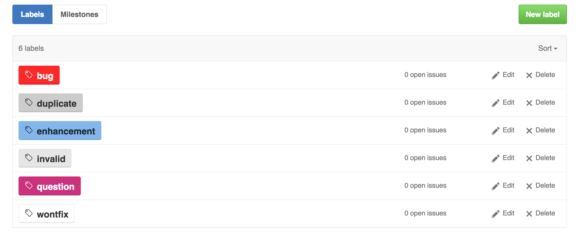
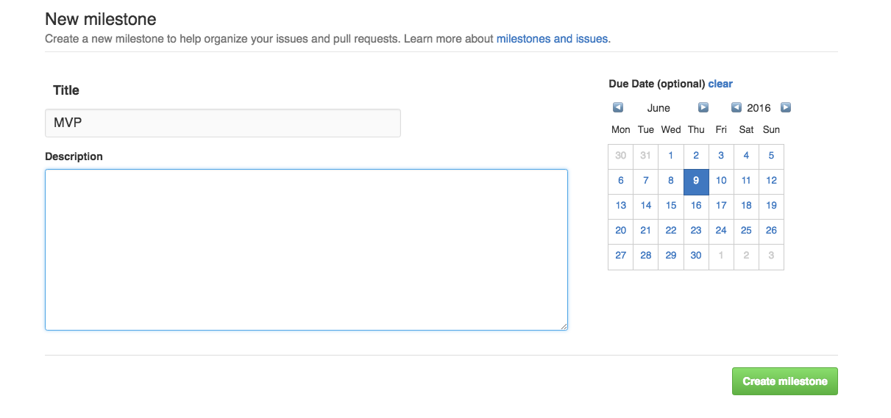
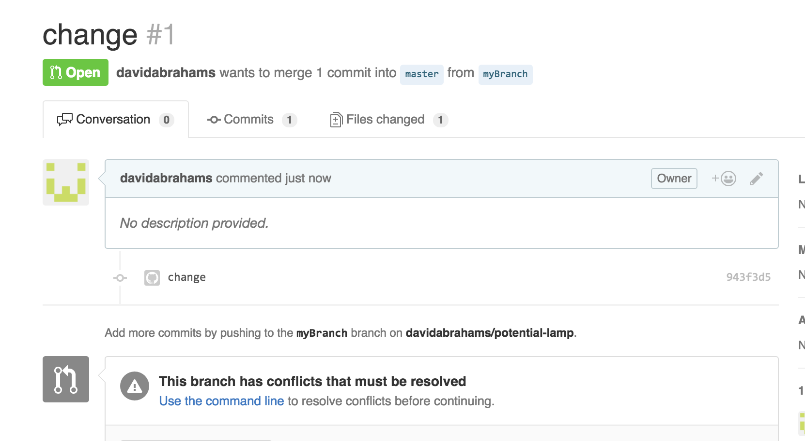

# Lesson 2 - Github and an Intro to Java

**Note**: The assignment for this lesson will be pretty time consuming and tricky if you don't have any Java exposure. It's our hope that after completing it you will feel comfortable enough to dive headfirst into Android Development. Start early, and be proactive about getting help/using outside resources to complete the assignment.

Submit the completed assignment [here](https://goo.gl/forms/AWH6hrJB0tXct1tk1).

Before starting this lesson, make sure to pull the upstream branch into your current one, and push your changes to be able to view the updates on Github.

```
$ git pull upstream master
$ git push origin master
```

## Android Phone Survey
In the beginning of class, please fill out [this survey](https://docs.google.com/forms/d/e/1FAIpQLSeRxNqNjGmApuXS7ZwsO5ERldkJnBRNexOaKKaBf5wx-jV_IA/viewform) so we know how many phones we need to provide next class.

##  Github

### Ideas behind a perfect repo

#### 1. What should the master branch contain?
Working and well-tested code that has been reviewed by peers.

#### 2. Non-master branches?
1. Each of these branch should mostly have one (maybe two if you are pair-programming a feature) person working on it. 
2. Each branch should add a significant working change to the master. Usually each branch adds a working feature to the master. Occassionally you will have a small bug that can be fixed in a few lines of code. Simply branch off master, make the change, and open a pull request to merge your fix.

#### 3. Issues:
1. Labels:

Every time you notice a bug, add it to the issues with the label “bug”. Whenever you/team decide to add a new features, enhancements can be used. You can use labels to prioritize certain fixed. You can also assign people to issues so that teammates don’t step into each other’s work. You can see what your teammates are working on.

2. Milestones:

Use this to properly scope your project and to make sure that your team is on track.

#### 4. Pull Requests:
1. An extra checkpoint in merging a branch to master (or other branches)
2. Peers can look at the changes a merge will add and get a chance to review/comment on/ask questions about the code
3. Peers can (and should) checkout the branch to test it out before merging.

#### 5. Merge Conflicts:
Working in a relatively large project with multiple other people will result in merge conflicts. It happens when the same line of code has been changed on master in your branch. Here's an example of a pull request with merge conflicts:



Let's resolve the merge conflict! Try understanding what each line does from a conceptual perspective.

```shell
$ git checkout master
Switched to branch 'master'
Your branch is up-to-date with 'origin/master'.
$ git pull origin master
From github.com:davidabrahams/potential-lamp
 * branch            master     -> FETCH_HEAD
Already up-to-date.
$ git checkout myBranch
Switched to branch 'myBranch'
$ git merge master
Auto-merging file.java
CONFLICT (content): Merge conflict in file.java
Automatic merge failed; fix conflicts and then commit the result.
```
Now, we should open that specific file in a text editor (for this class, it is going to be the Android Studio IDE. Usually, it is something like Sublime Text or Emacs). Merge conflicts might look something like this:

```java
<<<<<<< HEAD
public static int otherMethodName(int a, int b) {
=======
public static int newMethodName(int a, int b) {
>>>>>>> master
    // Body
}
```
What does it all mean? The code between `<<<<<<< HEAD` and `=======` is the code that you have written to your branch. And the code between `=======` and `>>>>>>> master` is the code that lives on master. It is up to you to determine which version is correct, and occassionally you will have to use code from both branches in order to create a working version. You want to presserve the feature changed you made, while also not removing features from master. Now, `git add` the files with merge conflicts. You should now be able to merge your branch to master. Once we've picked the correct version:

```shell
$ git add -A
$ git commit
[myBranch fd76144] Merge branch 'master' into myBranch
$ git push origin myBranch
Counting objects: 1, done.
Writing objects: 100% (1/1), 233 bytes | 0 bytes/s, done.
Total 1 (delta 0), reused 0 (delta 0)
To git@github.com:davidabrahams/potential-lamp.git
   943f3d5..fd76144  myBranch -> myBranch
```

The pull-request should now be mergeable on github.

#### 6. .gitignore

When you start collaborating on Android projects, there might be certain files you don't want to push to your repository (passwords, huge data files, etc.). It can be hard to manually `add` certain files while keeping out others. `.gitignore` helps us here by never tracking any changes in that file. Usually, `.gitignore` contains certain extensions but it can also contain folders and specific filenames. Android Studio creates a stock `gitignore`. Here's a great Android `gitignore`, (it's the default one github makes)

This is the `.gitignore` Android Studio creates for you.:

```
# Built application files
*.apk
*.ap_

# Files for the ART/Dalvik VM
*.dex

# Java class files
*.class

# Generated files
bin/
gen/
out/

# Gradle files
.gradle/
build/

# Local configuration file (sdk path, etc)
local.properties

# Proguard folder generated by Eclipse
proguard/

# Log Files
*.log

# Android Studio Navigation editor temp files
.navigation/

# Android Studio captures folder
captures/

# Intellij
*.iml
.idea/workspace.xml

# Keystore files
*.jks
```     

### Best Practices:
1.  Commits: Each commit should add a working part of the feature to the branch. 
2.  *Commit often* and write proper commit messages. The idea behind commit messages is that if a stranger/instructor reads through all the commits and commit messages, they should be able to understand how the project progressed. Example of a commit message: `“ADD: Sign-in form skeleton”`, `“EDIT: Subscribe button color/shape”`
3.  Pull Requests: After you are satisfied with the work done in your branch, you might want merge it into master. To do this, pull requests are used. Once you have created a pull request, your peers should review the changes you made and ask questions about parts they don’t understand. A pull-request should only be merged after n number of peers have reviewed the code and given it a :+1:. Your team can decide how exactly you want that to happen.
4.  (Highly recommended) Issues to track bugs/assign tasks to team members as well as to write down future goals

### Resources:
1. [Intro to Github flow](https://guides.github.com/introduction/flow/)
2. [Git Guide](http://rogerdudler.github.io/git-guide/)
3. [Github Issues](https://guides.github.com/features/issues/)
4. [Git Branching](https://git-scm.com/book/en/v2/Git-Branching-Basic-Branching-and-Merging)
5. [Git cheat sheet](https://www.git-tower.com/blog/git-cheat-sheet/)

### Try It Out!

This git tutorial is super cool because it not only let's you enter the commands but also visually see what happens in a certain repo. **[HW] Do at least 8 levels.** The levels you choose to do are up to you. If you feel pretty git-fluent, you may skip some of the earlier levels and do 8 later ones. It's up to you!
[Github tutorial](http://learngitbranching.js.org/)

## Java

### Getting started with Android Studio

We will be using Android Studio as our IDE, even though (for this class) we won't actually be creating an Android app.

1. Create a new Android Studio Project
2. Name it (something?)
3. Select Phone and Tablet, API 15 (This doesn't really matter for now)
4. Empty Activity
5. Finish

Note that when you create a new project, Android Studio creates a `.gitignore` for you. Usually when you create a new Android Studio project it is smart to do a:

```
$ git commit -a -m "Creating Android Studio project."
$ git push origin $(current_branch)
```

just to add all the libray files required by Android Studio. 

You should now have a basic Android application skeleton. We won't be using the skeleton, so we'll create our own Module.

1. Click File > New > Module.
2. Select Java Library and click Next.
3. For Java class name, use "HelloWorld". Click Finish.
4. You should now see a Java module (in a folder with whatever name you gave it) inside your Android project.

### Hello World

**[HW] Copy paste into `HelloWorld.java` and read over the following code:**

```java
public class HelloWorld {

    public static void main(String[] args) {
        System.out.println("Hello World!");
    }

}
```

A window button should appear next to the main method header. **[HW] Click it to run your program!**

```
Hello World!
```

Don't worry too much yet about what all the words in `public static void main(String[] args)` mean. For now, just remember that this is the **main method**, and that every java program must have a main method defined. This main method is what the Java Virtual Machine runs initially, and all subsequent code eventually stems from the main method.

# `Account` and `MoneySaver`

#### Classes

**[HW] Create two new classes, and copy paste the following boilerplates into them:**

```java
public class MoneySaver {

    private long myMoney;
    private Account myAccount;
    private String name;


    public MoneySaver(String name, long money) {
        this.name = name;
        myMoney = money;
    }

    public String getName() {
        return name;
    }

    public Account getMyAccount() {
        return myAccount;
    }

    public String toString() {
        return name + ", " + "My balance is: "+ myMoney;
    }

    public void deposit(int amount) {
    }

    public void withdraw(int amount) {
    }
    
    public void signUpForChecking(int amount) {
    }

    public static void main(String[] args) {
    }
}

```

```java
public class Account {

    private long amount;

    public String toString() {
        return "Account Balance: $" + amount;
    }

    public static Account largerAccount(Account acc1, Account acc2) {
    }

}

```

##### Constructors

The constructor is a special method used to initialize instances of your class (just like Python's `__init__` method). Classes by default inherit a no-argument constructor from the default `Object` class. That means that even without epxlicitly defining a constructor, we can already initalize an `Account`:

```Account a = new Account() // This works!```

Often, you will want to initialize your object with some values. In this case you must define your own constructor. You can even define multiple constructors, each with different arguments.

**[HW] Go ahead and implement the `Account` constructor. It should have input arguments `long amount`**

#### Fields

You'll notice both classes also have fields. Fields are either attributes of members of a class (an `amount` describes an `Account`) or things that belong to the class (a `MoneySaver` has an `account`). *Fields should almost exclusively be `private` unless you have a really good reason to make it `public`.* If you want an outside class to be able to access a field, you must create public getter/setter methods.

**[HW] Define and implement the `getAmount` and `setAmount` methods in `Account`. Make sure they have appropriate return types and input arguments.**

**[HW] Add the following to your main method (`public static void main(String[] args)`) to test your code so far:**

```java
Account a = new Account(100);
System.out.println(a);
a.setAmount(20);
System.out.println("New amount: " + a.getAmount());
```

Expected output:

```
Account Balance: $100
New amount: 20
```

#### Methods

These classes also have methods, which are things instances can "do". Each method must specify what it returns, (`void` if nothing). Generally speaking methods are `public`. However, you might find yourself writing a `private` method that nothing outside the class should be able to see. Often, "helper" methods are `private`.

**[HW] implement `deposit` in `Account`.**

Test your code:

```java
Account a = new Account(100);
System.out.println(a);
a.setAmount(20);
a.deposit(10);
System.out.println("New amount: " + a.getAmount());
```

```
Account Balance: $100
New amount: 30
```

##### What does `static` mean?

`static` methods operate on the *Class*, as opposed to *instances* of the class. `static` variables are properties of the entire class as opposed to instances of that class. You can call static methods without creating any objects e.g. `Collections.sort()`. Make a method `static` if the method is something the *Class* can do, and doesn't need any instance variables to work properly (`static` methods *can* require `static` variables, though).

**[HW] Implement `largerAccount` in `Account`. Test your implementation!**

```java
Account small = new Account(20);
Account big = new Account(30);
System.out.println(Account.largerAccount(small, big));
```

```
Account Balance: $30
```

#### Inheritance

##### `extends`

**[HW] Define a class `CheckingAccount` that `extends` from `Account`.** CheckingAccount now has all of the methods that `Account` does. **[HW] Give it a constructor with a similar signature to `Account`'s construtor.** If you need help implementing the constructor, check out [this](https://docs.oracle.com/javase/tutorial/java/IandI/super.html) website.

**[HW] Read about overriding functions [here](http://www.tutorialspoint.com/java/java_overriding.htm). Then override the `toString()` method in `CheckingAccount` so that it returns something like: `"Checking Account Balance: $50"`**

**[HW] Give your `CheckingAccount` a `withdraw` method.** This function should properly update the account balance. The return type should be `void`.

Finally, you are ready for your `MoneySaver` to be able to sign up for a checking account. **[HW] Implement `signUpForChecking`. This function should initialize `myAccount` to a new `CheckingAccount`, with a balance equal to the `amount` specified in the function's input. It should also subtract the amount from the `MoneySaver`'s `myMoney`. Test your implementation with the following code:**

```java
MoneySaver david = new MoneySaver("David", 100);
david.signUpForChecking(50);  // put 50 dollars in a checking account
System.out.println(david);
System.out.println(david.getMyAccount());
```

```
David, My balance is: 50
Checking Account Balance: $50
```

Realize that you can store a `CheckingAccount` instance in `myAccount` without changing its type from `Account`! This is an example of *polymorphism*. Because a `CheckingAccount` *is an* `Account`, you can store `CheckingAccount`s in `Account`s.

Note that you can't do it the other way around. Try putting this code in your project:

```java
CheckingAccount specific = new Account(100, new MoneySaver("Bill", -20)); // Incompatible types error
```

This is because `CheckingAccount` is the specific subclass, and `Account` is the general `superclass`.

**[HW] Give your `MoneySaver` a `withdraw` method.** You will have to [cast](http://javarevisited.blogspot.com/2012/12/what-is-type-casting-in-java-class-interface-example.html) `myAccount` to a `CheckingAccount` in order to call its `withdraw` method. This is because `Account`s don't have `withdraw` methods, only `CheckingAccount`s do. You have to explicitly tell Java that the account is a `CheckingAccount` to call `withdraw`.

**[HW] Test your code from this section:**

```java
MoneySaver jim = new MoneySaver("Jim", 100);
jim.signUpForChecking(30);
CheckingAccount acc = (CheckingAccount) jim.getMyAccount();
System.out.println(jim);
System.out.println(acc);
jim.deposit(40);
System.out.println(jim);
System.out.println(acc);
jim.withdraw(60);
System.out.println(jim);
System.out.println(acc);
```

```
Jim, My balance is: 70
Checking Account Balance: $30
Jim, My balance is: 30
Checking Account Balance: $70
Jim, My balance is: 90
Checking Account Balance: $10
```

##### Abstraction

The last thing we will learn about inheritance is the `abstract` keyword. The `abstract` keyword goes in the class declaration (`public abstact class...`). This keyword does two things:

* You can now declare `abstract` methods. These methods have no body, but classes that extend them must define these methods. For example, let's say you had an abstract `Vehicle` class:

```java
public abstract class Vehicle {

    int wheels;
    
    public Vehicle(int wheels) {
        this.wheels = wheels;
    }

    public int getWheels() {
        return wheels;
    }

    public abstract void turnOn();
}
```

This says that all classes `extend`ing `Vehicle` must implement `turnOn`. Why doesn't Vehicle implement `turnOn`? Well, what a vehicle must do to turn on depends on what kind of vehicle it is! The implementation would be quite difficult for a `Car` as opposed to a `Boat`. (Boats turn on, right?)

Note that the `Car` and `Boat` classes would both have the inhereted method `getWheels()`, so you wouldn't have to implement it repetitively in each subclass. However, you cannot initialize instances of the `abstract` class. Using the above example:

```java
public class Car extends Vehicle {
    public void turnOn() {
        ...
    }
}
Vehicle v = new Vehicle(); // This doesn't work.
Vehicle v = new Car(); // This works!
v.turnOn(); // This works because all Vehicles have a turnOn method.
Car c = new Car(); // This works too.
c.turnOn();
```

**[HW] Make your `Account` class `abstract`. Confirm that you can't initalize it anymore.**

You've reached the end of the `MoneySaver` portion of the assignment! **[HW] Test that the entire project works by creating a new class `MoneyTester` and confirming that its `main` method has the correct output:**

```java
public class MoneyTester {

    public static void main(String[] args) {
        Account a = new CheckingAccount(100);
        System.out.println(a);
        a.setAmount(20);
        System.out.println("New amount: " + a.getAmount());

        a = new CheckingAccount(100);
        System.out.println(a);
        a.setAmount(20);
        a.deposit(10);
        System.out.println("New amount: " + a.getAmount());

        Account small = new CheckingAccount(20);
        Account big = new CheckingAccount(30);
        System.out.println(Account.largerAccount(small, big));

        MoneySaver david = new MoneySaver("David", 100);
        david.signUpForChecking(50);  // put 50 dollars in a checking account
        System.out.println(david);
        System.out.println(david.getMyAccount());

        MoneySaver jim = new MoneySaver("Jim", 100);
        jim.signUpForChecking(30);
        CheckingAccount acc = (CheckingAccount) jim.getMyAccount();
        System.out.println(jim);
        System.out.println(acc);
        jim.deposit(40);
        System.out.println(jim);
        System.out.println(acc);
        jim.withdraw(60);
        System.out.println(jim);
        System.out.println(acc);
    }

}
```

Expected Output:

```
Checking Account Balance: $100
New amount: 20
Checking Account Balance: $100
New amount: 30
Checking Account Balance: $30
David, My balance is: 50
Checking Account Balance: $50
Jim, My balance is: 70
Checking Account Balance: $30
Jim, My balance is: 30
Checking Account Balance: $70
Jim, My balance is: 90
Checking Account Balance: $10
```

# Animal Farm

**[HW] Do the following steps:**

1. Define an abstract class `Animal`. Animals have a number of `legs`, a `name`, a `color`, a `species`, and a `weight`.
2. Implement a constructor for the Animal class.
3. Implement getter and setter methods for each field using the `getFieldName()` `setFieldName()` naming convention. (Android Studio can do this automatically for you very quickly.)
4. Define the abstract method `grow()`.
5. Define the `Animal` subclasses `Cat`, `Dog`, `Cow`. Each should have a constructor with input arguments `(name, color)`. If you're having trouble, check out [this](http://www.tutorialspoint.com/java/java_abstraction.htm) example. Have cats and dogs' weights be initalized randomly between 0-25, and cows 100-200.
6. Make the `grow` method in `Cat` multiply its weight by 3, in `Dog` by 1.5, and in `Cow` by 5.
7. Define a class `Farm`. A farm should have an `ArrayList` of `Animal`s.
8. Give the `Farm` class an `addAnimal` function which adds an Animal object to the underlying `ArrayList`. Add a `getAnimal` function, which returns the Animal object at a specified index in the `ArrayList`.
9. Define `getHeaviestAnimals()` in `Farm`, which returns a new (don't modify the underlying ArrayList) sorted ArrayList.
10. Define `printCatNames()`, which prints each cat's name to a new line in the console.
11. Define `averageLegs()`, which returns the average number of legs amongst the animals in the farm.
12. Check if your methods are behaving like they are supposed to. Similar to the quick debugging "tests" we previously used, you should make instances of the classes and print the outcome of methods along with the expected outcome.
13. To finish up this assignment, do some googling on what an `interface` in Java is. Explain in the google form the difference between an `interface` and an `abstract class`.

In addition to the tests you have done, these are the tests we will use to check that you completed the assignment correctly. Run them and make sure your code works!

```java
Cat c = new Cat("Meowth", "black");
Dog d = new Dog("Puppy", "brown");
Cow cow = new Cow("Mooer", "white");
System.out.println("Test 1 Passed: " + (c.getWeight() >= 0 && c.getWeight() <= 25));
System.out.println("Test 2 Passed: " + (d.getWeight() >= 0 && d.getWeight() <= 25));
System.out.println("Test 3 Passed: " + (cow.getWeight() >= 100 && cow.getWeight() <= 200));

double old_weight_cat = c.getWeight();
double old_weight_dog = d.getWeight();
double old_weight_cow = cow.getWeight();
c.grow();
d.grow();
cow.grow();
System.out.println("Test 4 Passed: " + (c.getWeight() / old_weight_cat == 3));
System.out.println("Test 5 Passed: " +
        (Math.abs(d.getWeight() / old_weight_dog - 1.5) < 0.01));
System.out.println("Test 6 Passed: " + (cow.getWeight() / old_weight_cow == 5));

Farm farm = new Farm();
farm.addAnimal(c);
farm.addAnimal(d);
farm.addAnimal(cow);

ArrayList<Animal> sorted = farm.getHeaviestAnimals();
for(int i = 0; i < sorted.size() - 1; i++) {
    System.out.println("Test " + (i + 7) + " Passed: " + (sorted.get(i).getWeight() > sorted.get(i + 1).getWeight()));
}
System.out.println("Test 9 Passed: " + (farm.getAnimal(0) == c));
System.out.println("Test 10 Passed: " + (farm.getAnimal(1) == d));
System.out.println("Test 11 Passed: " + (farm.getAnimal(2) == cow));
c.setLeg(7);  // lol 7 legged cat
System.out.println("Test 12 Passed: " + (farm.averageLegs() == 5));

System.out.println("Printing 'Meowth'...");
farm.printCatNames();

```

```
Test 1 Passed: true
Test 2 Passed: true
Test 3 Passed: true
Test 4 Passed: true
Test 5 Passed: true
Test 6 Passed: true
Test 7 Passed: true
Test 8 Passed: true
Test 9 Passed: true
Test 10 Passed: true
Test 11 Passed: true
Test 12 Passed: true
Printing 'Meowth'...
Meowth
```

# The `Fraction` class

**[HW] Create a new class called `Fraction`.**

```java
public class Fraction {

    private int numerator;
    private int denominator;

    public String toString() {
        return Integer.toString(numerator) + "/" + Integer.toString(denominator);
    }

}
```

**[HW] Implement a constructor. In the arguments, have the numerator come first.**

#### `gcd`

**[HW] Give your `Fraction` a `gcd` function, which returns the greatest common diviser of two integers. The function should have the following header:**

```java
public static int gcd(int m, int n)
```

and should work if `n > m`, and vice-versa.

There's a pretty sweet recursive algorithm for `gcd` called *Euclid's Algorithm* which states that the `gcd(a, b)` is:

```java
// This function assumes a>b. Your's should not!
function gcd(a, b)
    If b is 0:
        return a
    Else:
        return gcd(b, a mod b)
```

Why does it make sense for `gcd` to be `static`? If you're not sure, ask a peer or an instructor.

#### `simplify`

**[HW] Give your `Fraction` a `simplify` function, which simplifies the fraction. We leave it up to you to determine the proper method header.**

#### `add`

**[HW] Give your `Fraction` an `add` function, which should add the other fraction to this fraction, and return the simplified result.** *This function should not modify either fraction*. You shouldn't change the [Access Modifiers](http://www.tutorialspoint.com/java/java_access_modifiers.htm) to the `numerator` and `denomenator` fields (they should be private).

## Test your functions

**[HW] Create a new class called `FractionTester`. Copy-paste the following code into it. All the tests should pass:**

```java
public class FractionTester {

    public void runTests() {
        Fraction f1 = new Fraction(10,20);
        Fraction f2 = new Fraction(2,3);
        System.out.println(f1.add(f2) + " = 7/6");
        System.out.println(f1 + " = 10/20");
        System.out.println(f2 + " = 2/3");
        f1.simplify();
        System.out.println(f1 + " = 1/2");
        System.out.println(Fraction.gcd(9, 2) + " = 1");
        System.out.println(Fraction.gcd(24, 18) + " = 6");
    }

    public static void main(String[] args) {
        FractionTester tester = new FractionTester();
        tester.runTests();
    }
}

```

If you believe you correctly implemented the homework but your tests aren't passing, please talk to the teaching team so we can make sure the tests are correct.

## Assignment

Your homework is to do all bolded **[HW]** sections of this README. You should have completed the following four portions of this assignment:

1. The Github Tutorial
2. The MoneySaver Java code
3. The Animal Farm Java code
4. The Fraction Java code

Fill out [this](https://goo.gl/forms/AWH6hrJB0tXct1tk1) form when you're done!
